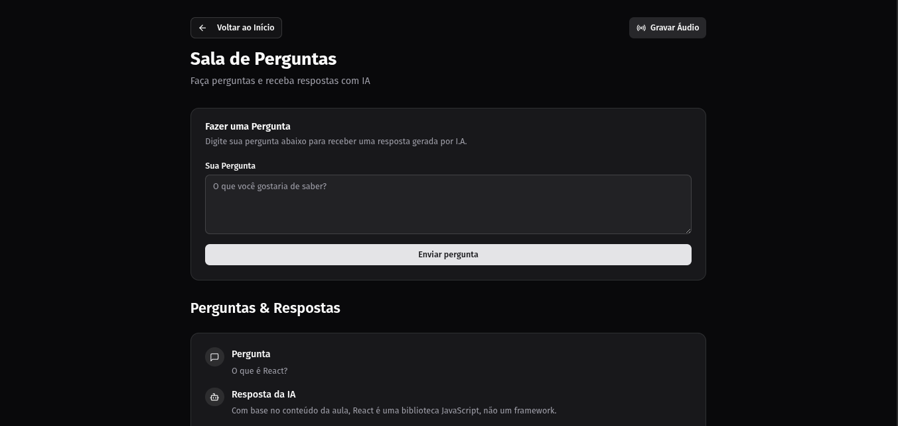
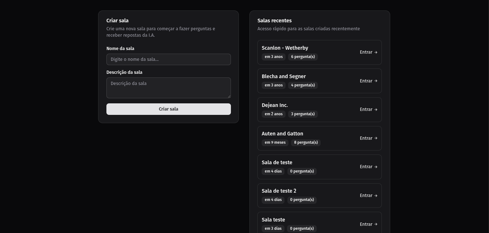
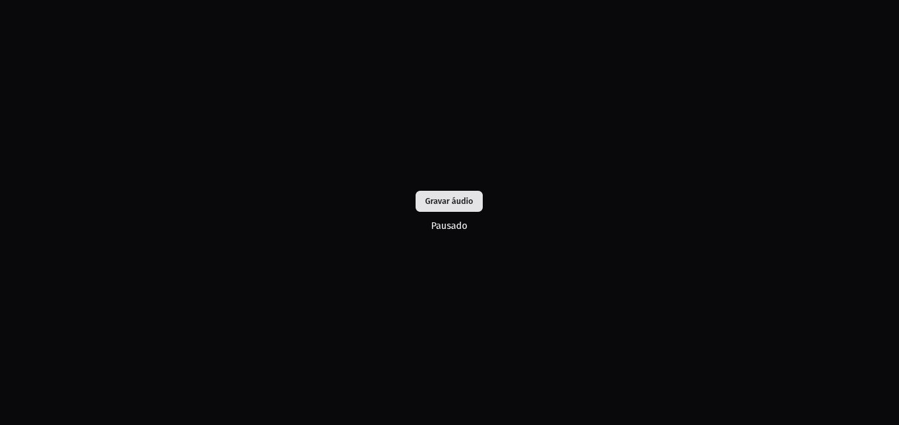

<h1 align="center">
  

  NLW Agents
</h1>

<p align="center">
  

  

  
  
  <a href="https://github.com/pabloxt14/nlw-agents-react/commits/master">
    
  </a>
    
   

   <a href="https://github.com/pabloxt14/nlw-agents-react/stargazers">
    
  </a>
</p>

<p>
  
</p>

<h4 align="center"> 
	🚀 Aplicação finalizada 🚀
</h4>


## 💻 Sobre

Projeto desenvolvido durante o evento NLW Agents da Rocketseat para demonstrar o uso de agentes inteligentes de IA na web.

## 🎨 Layout

A seguir, veja uma demonstração das principais telas da aplicação:

### Create Room

<p align="center">
  
</p>

### Room

<p align="center">
  
</p>

### Record Audio

<p align="center">
  
</p>

## 🚀 Tecnologias

- **React 19.1** - Biblioteca para interfaces de usuário
- **TypeScript 5.8** - Superset JavaScript com tipagem estática
- **Vite 7.0** - Build tool e servidor de desenvolvimento
- **TailwindCSS 4.1** - Framework CSS utility-first
- **React Router Dom 7.6** - Biblioteca de roteamento
- **TanStack React Query 5.8** - Gerenciamento de estado servidor e cache
- **Radix UI** - Componentes primitivos acessíveis
- **Shadcn/ui** - Sistema de componentes
- **Lucide React** - Biblioteca de ícones

## 📂 Padrões de Projeto

- **Component-based Architecture** - Arquitetura baseada em componentes React
- **File-based Routing** - Roteamento baseado em arquivos com React Router
- **Server State Management** - Gerenciamento de estado servidor com React Query
- **Variant-based Components** - Componentes com variantes usando CVA
- **Composition Pattern** - Padrão de composição com Radix Slot
- **Path Aliasing** - Alias de caminhos (`@/` aponta para `src/`)

## ⚙️ Configuração do Projeto

### Pré-requisitos

- Node.js (versão 18 ou superior)
- npm ou yarn

### Instalação

1. Clone o repositório
2. Instale as dependências:
   ```bash
   npm install
   ```

3. Execute o servidor de desenvolvimento:
   ```bash
   npm run dev
   ```

4. Acesse a aplicação em `http://localhost:5173`

### Scripts Disponíveis

- `npm run dev` - Inicia o servidor de desenvolvimento
- `npm run build` - Gera build de produção
- `npm run preview` - Preview do build de produção

### Backend

O projeto consome uma API que deve estar rodando na porta 3333. Certifique-se de que o backend esteja configurado e executando antes de iniciar o frontend. [link do back-end](https://github.com/PabloXT14/nlw-agents-node)

## 🛠️ Estrutura do Projeto

```
src/
├── components/ui/       # Componentes de interface
├── components/pages/    # Componentes de páginas
├── http/                # HTTP requests e hooks para consumir a API
├── pages/               # Páginas da aplicação
├── lib/                 # Utilitários e configurações
└── app.tsx              # Componente raiz
``` 

---

Desenvolvido com ❤️ durante o NLW da Rocketseat 🚀